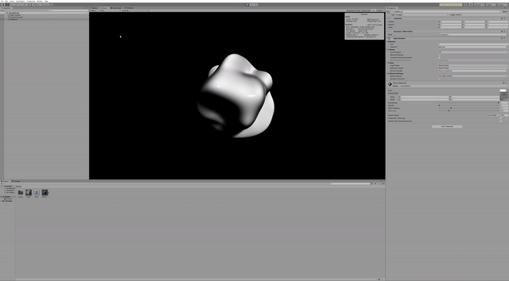
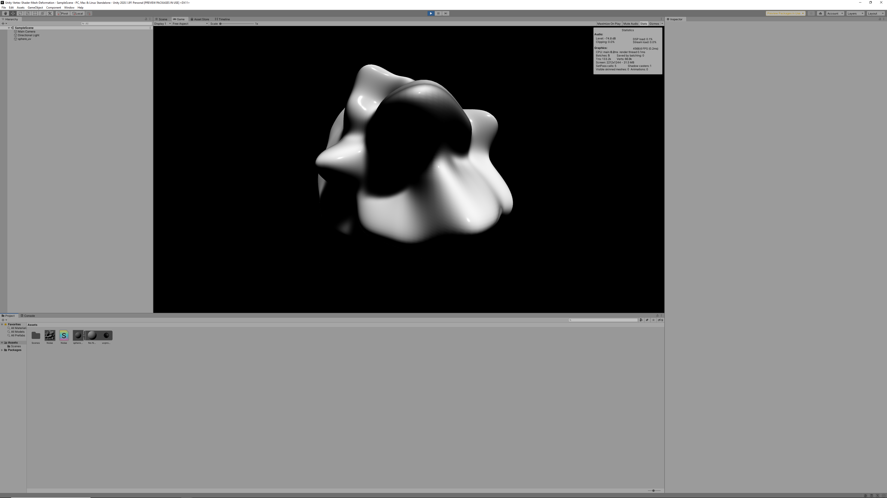

# Unity-Vertex-Shader-Mesh-Deformation
 This is an example of fluid mesh deformation with a vertex shader.
 My main challenge was to properly recalculate vertex normals after modifying vertices.
 To fluidly deform a mesh, I modeled a sphere containing over 100,000 vertices. In addition, I found that changing `Normals Mode` was essential in order to achieve the look that I was after. The Normals Mode should be `Unweighted`, otherwise the surface of the sphere will not be smoothed out.

 
 
## Demo
[This video](https://www.instagram.com/p/CDwaSB5nIm-/) on Instagram will show how the deformation looks like after post-processing effects are applied such as AO, and Anti-aliasing.
